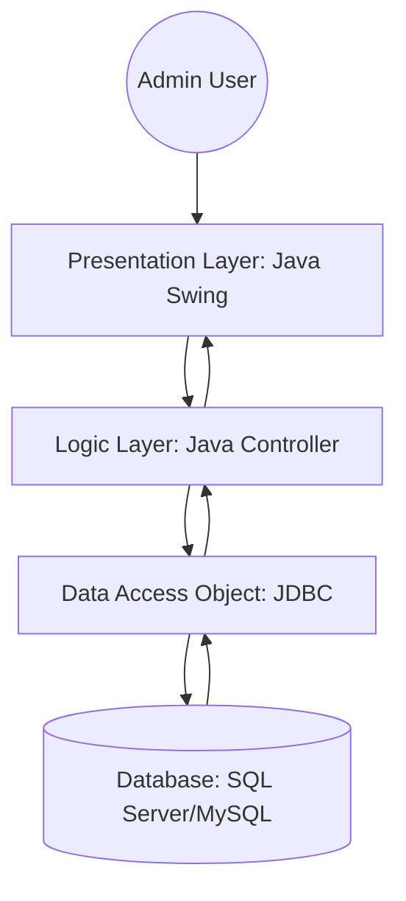
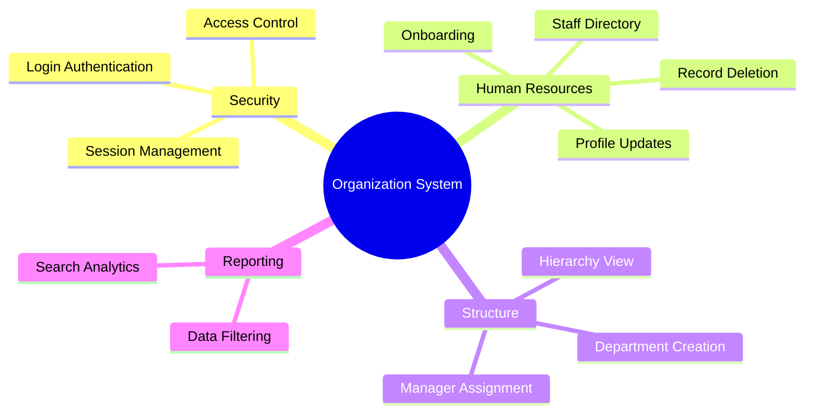

# Organization Management System (OMS) 🚀

A modern web-based management system with professional CSS layouts and employee tracking.
---
## 📖 About the Project
Managing a growing organization requires a reliable way to track human resources and departmental data. This project provides a robust interface for administrators to handle complex organizational tasks. Built with a focus on **Data Integrity** and **User Experience**, it utilizes **Java Swing** for the UI and **JDBC** for seamless database communication.

## ✨ Key Features
* **Employee Lifecycle Management:** Comprehensive CRUD operations (Add, View, Update, Delete) for employee records.
* **Departmental Oversight:** Create and manage departments, assigning leadership and tracking team distributions.
* **Advanced Search Engine:** Instantly locate staff using multi-filter search options (Name, ID, or Role).
* **Role-Based Security:** Secure login system to ensure only authorized administrators can modify organizational data.
* **Interactive Dashboard:** A clean, cinematic UI providing a bird's-eye view of the organization's status.
---
## 🏗️ System Architecture
This diagram illustrates the multi-tier architecture of the application, showing how the UI interacts with the database.

## ⚙️ Functional Breakdown
A mindmap showing the core functional modules integrated into the system.

## 👥 Use Case Diagram
This diagram represents the interaction between the Administrator (Actor) and the system's primary functions.
```mermaid
useCaseDiagram
    actor Admin
    rectangle "Organization Management System" {
        Admin --> (Authenticate Login)
        Admin --> (Manage Employee Records)
        Admin --> (Oversee Departments)
        Admin --> (Query System Data)
        (Manage Employee Records) ..> (Database Sync) : <<include>>
        (Oversee Departments) ..> (Database Sync) : <<include>>
    }
```

## 🛠️ Technical Stack
* **Framework:** ASP.NET Core
* **Database:** SQL Server (Dapper ORM)
* **UI/UX:** Custom Cinematic CSS & Responsive Design
---
### 🖼️ Project Gallery
<details>
  <summary><b>Click to View Cinematic Interface (10 Screenshots)</b></summary>
  <br>
  
#### 1. Landing & Introduction
| Home Page | Hero Section | About Us |
| :---: | :---: | :---: |
|  |  |  |

#### 2. Main Dashboard
<p align="center">
  
</p>

#### 3. Organization Management
| Overview | Create | Edit | Delete |
| :---: | :---: | :---: | :---: |
|  |  |  |  |

#### 4. Department Management
| Overview | Create | Edit | Delete |
| :---: | :---: | :---: | :---: |
|  |  |  |  |

#### 5. Position Management
| Overview | Create | Edit | Delete |
| :---: | :---: | :---: | :---: |
|  |  |  |  |

#### 6. Employee Management
| Overview | Create | Edit | Delete |
| :---: | :---: | :---: | :---: |
|  |  |  |  |

#### 7. Contact Us
<p align="center">
  
</p>
</details>

---
